# P:dback — AI 기반 실전 화상 면접 솔루션

> Vision AI와 STT를 결합하여 자세·시선·답변을 실시간 분석하고,  
> Gemini AI가 질문별 상세 피드백을 제공하는 개발자 맞춤형 면접 연습 플랫폼

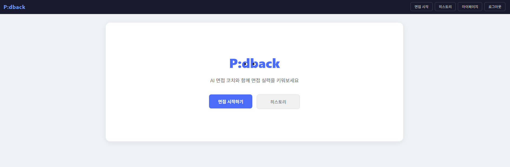

---

## 목차

- [프로젝트 소개](#프로젝트-소개)
- [관련 문서](#관련-문서)
- [기술 스택](#기술-스택)
- [프로젝트 구조](#프로젝트-구조)
- [주요 기능](#주요-기능)
- [내 담당 기능 상세](#내-담당-기능-상세)
- [API 엔드포인트](#api-엔드포인트)
- [로컬 실행 방법](#로컬-실행-방법)
- [회고 및 개선사항](#회고-및-개선사항)

---

## 프로젝트 소개

**🖥️ 배포 주소**: [https://pdback.live](https://pdback.live)

P:dback은 실제 화상 면접 환경을 시뮬레이션하여 기술 면접을 연습할 수 있는 웹 애플리케이션입니다.  
MediaPipe 기반의 Vision AI로 자세와 시선을 분석하고, STT로 음성 답변을 텍스트로 변환한 뒤, <br>
Google Gemini API가 질문별 피드백과 종합 점수를 산출합니다.

- **개발 기간**: 2026.03.12 - 2026.04.02
- **구성**: 5인 팀 프로젝트
- **배포 환경**: AWS EC2 + Docker + GitHub Actions CI/CD

| 이름 | 역할 |
|------|------|
| [김상혁](https://github.com/gabriel-1204) | 초기 세팅, 인프라, Docker / AWS EC2 배포, CI/CD, mediapipe |
| [김유선](https://github.com/kimyuseon) | 회원가입 / 로그인 / 마이페이지 (user 백엔드 + 프론트엔드), 인증 |
| [김평일](https://github.com/Pyeongil) | Gemini 프롬프트 설계, 면접 설정 페이지, Gemini API 클라이언트 |
| [이영진](https://github.com/ilove0628yj-w) | 면접 페이지, 세션 진행 (interview 도메인 백엔드 + 프론트엔드) |
| [박지영](https://github.com/battlegroundcallofduty) | 피드백 생성 / 조회, 면접 history (feedback 백엔드 + 프론트엔드) |

---

## 관련 문서

- [발표자료](https://docs.google.com/presentation/d/1MYbXQMjmEeGZ17ftSzQG7iYQLF4TTpXkVjnmqI-kvqE/edit?usp=sharing)
- [서비스 플로우차트 계획](https://battlegroundcallofduty.github.io/Pdback_live/assets/flowchart.html)
- [초반 DB 스키마](https://battlegroundcallofduty.github.io/Pdback_live/assets/pdback-schema%20(1).html)

---

## 기술 스택

### Backend


### AI / Interview Engine


### Frontend


### Infra / DevOps


---

## 프로젝트 구조

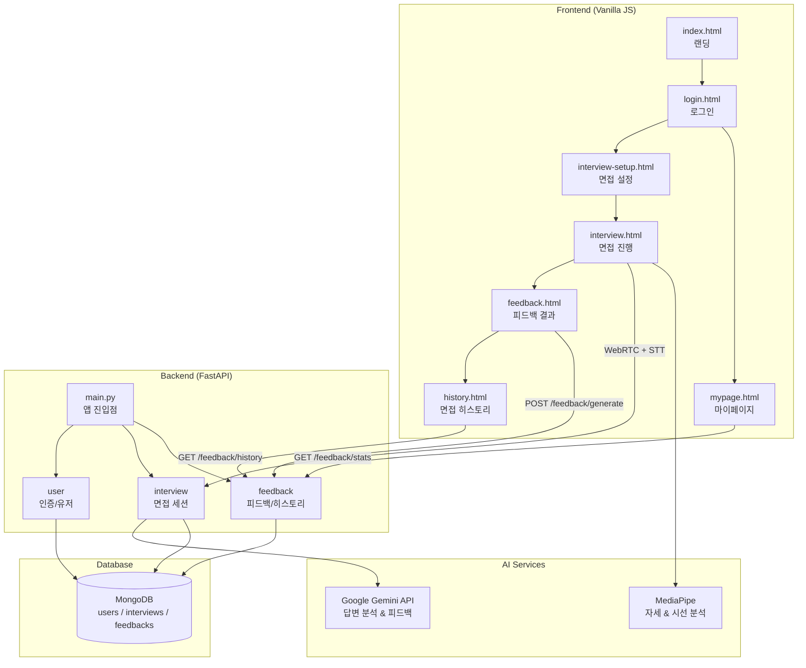


---

## 주요 기능

### 1️⃣ 회원가입 · 로그인
| 회원가입 | 로그인 |
|:---------:|:---------:|                                                                                                              
| 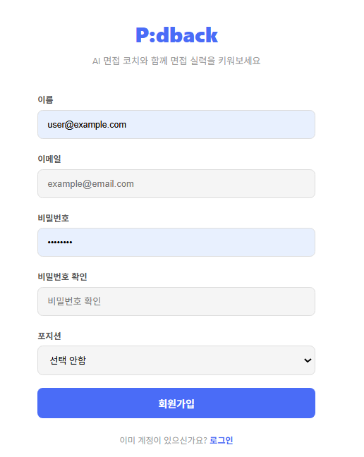 | 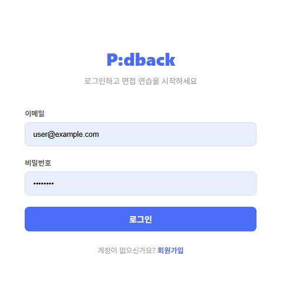 | 

### 2️⃣ 면접 설정 · 진행 · AI 분석

- **AI 면접 진행**: Gemini 기반 면접관 페르소나로 실시간 질의응답
- **자세 / 시선 분석**: MediaPipe로 자세 안정성 및 카메라 시선 처리율 실시간 측정
- **음성 인식 (STT)**: Web Speech API로 답변 음성을 텍스트로 변환

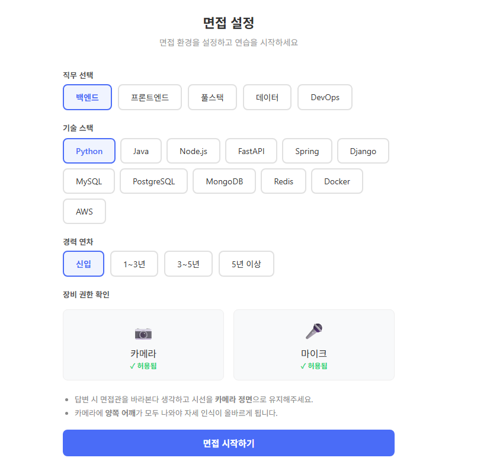
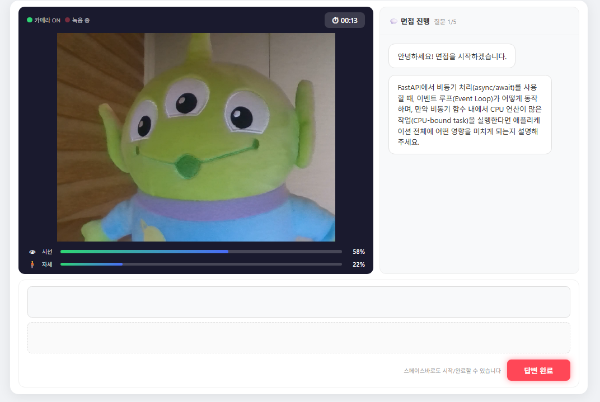

### 3️⃣ AI 피드백 생성

- 질문별 점수, 기술 / 논리 / 키워드 종합 점수, 강점 및 개선점 제공
- 자세·시선 점수와 코멘트 자동 생성

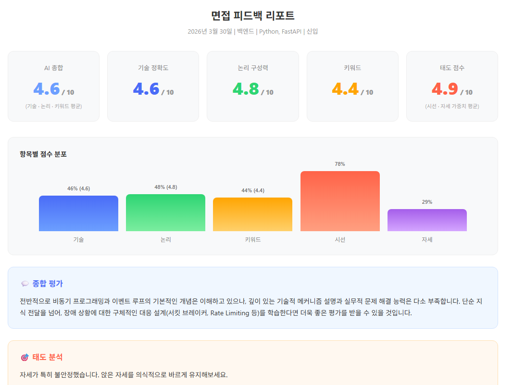
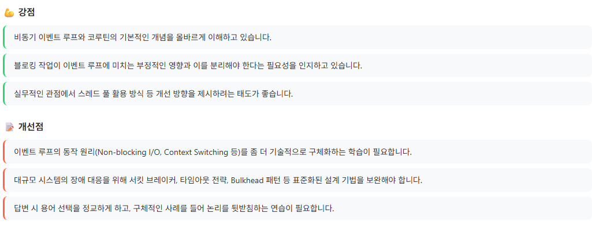
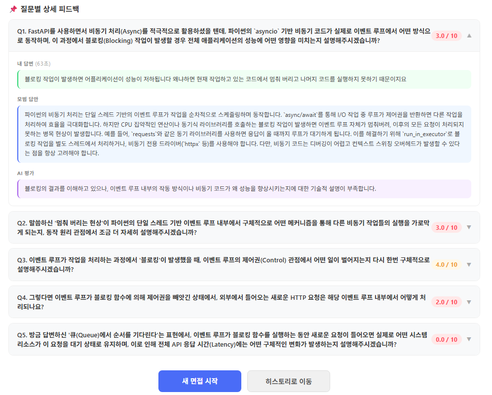

### 4️⃣ 면접 히스토리

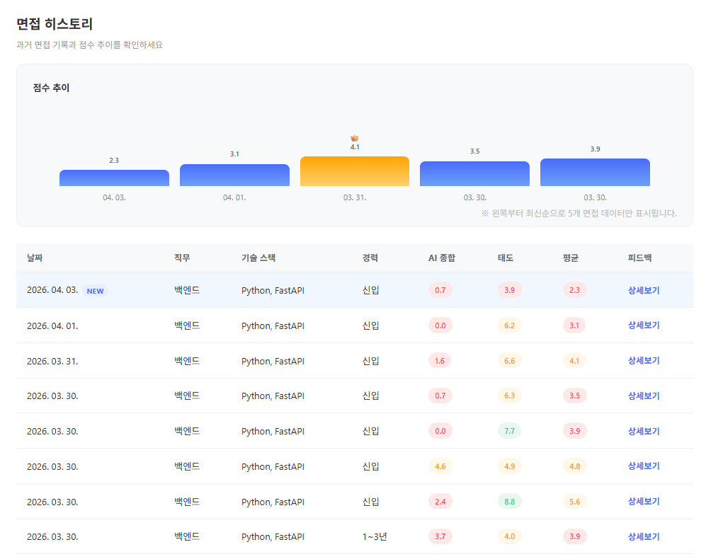

- 과거 면접 목록 최신순 조회 및 점수 추이 바 차트 시각화

### 5️⃣ 마이페이지

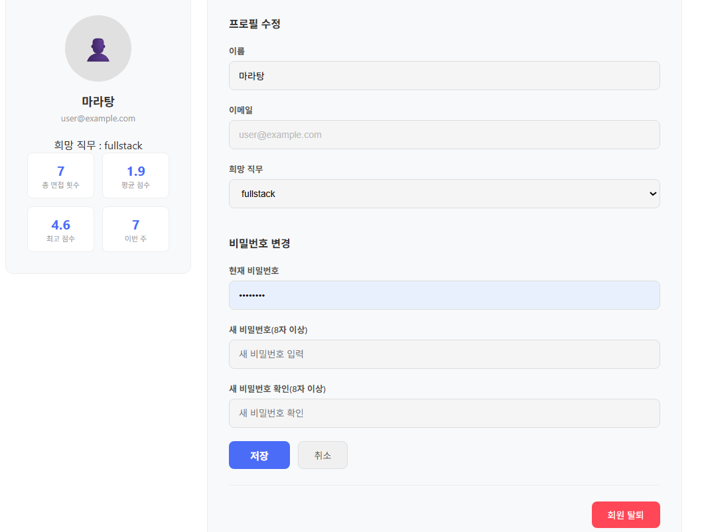

- 프로필 수정, 비밀번호 변경 및 총 면접 횟수, 평균 점수, 최고 점수, 이번 주 면접 횟수 집계

---

## 내 담당 기능 상세

**담당 범위**: `feedback` 도메인 전체 (백엔드 + 프론트엔드)  
`app/domain/feedback/`, `frontend/pages/feedback.html`, `frontend/pages/history.html`, `frontend/js/feedback.js`, `frontend/js/history.js`

### 1. 피드백 생성 및 조회 (feedback.html)

면접 종료 후 면접 세션 데이터를 바탕으로 AI 피드백을 생성하고 결과를 시각화합니다.

- **중복 생성 차단**: 동일 면접에 대해 피드백이 이미 존재하면 `409 Conflict` 반환 — 면접 종료 직후 새로고침이나 버튼 중복 클릭 시 같은 document가 두 번 삽입되는 것을 방지

  ```python
  existing = await db["feedbacks"].find_one({"interview_id": session_id})
  if existing:
      raise HTTPException(status_code=409, detail="이미 생성된 피드백이 존재합니다. 히스토리 페이지를 참고해주세요.")
  ```

- **소유자 검증**: 타인의 면접 데이터에 대한 피드백 생성/조회 방지 (`403 Forbidden`)

  ```python
  if interview.user_id != user_id:
      raise HTTPException(status_code=403, detail="본인의 면접에 대한 피드백만 생성할 수 있습니다.")
  ```
- **AI 피드백 파싱**: Gemini 응답이 마크다운 코드블록으로 래핑되는 경우를 대비해 정규식으로 벗겨낸 뒤 JSON 파싱 — 외부 AI API 응답을 신뢰하지 않는 방어적 처리

  ```python
  raw = response.text.strip()
  try:
      data = json.loads(raw)           # 깔끔한 JSON이면 바로 파싱
  except json.JSONDecodeError:
      raw = re.sub(r"^```(?:json)?\s*", "", raw)   # 앞 ```json 제거
      raw = re.sub(r"\s*```$", "", raw).strip()    # 뒤 ``` 제거
      data = json.loads(raw)           # 재시도
  ```
- **자세/태도 점수 산출**: 시선 처리율(`eye_contact`)과 자세 안정성(`posture_safety_rate`)을 가중 평균(`시선 40% + 자세 60%`)하여 태도 점수 계산, 두 지표를 각각 부족(60 미만) / 보통(60~80) / 완벽(80 이상) 3단계로 나눈 조합별 9가지 코멘트 자동 생성
- 
- **응답 시간 표시**: 질문별 내 답변 옆에 소요 시간(duration_seconds)을 함께 표시

### 2. 면접 히스토리 (history.html)

사용자의 과거 면접 목록을 최신순으로 조회하고, 점수 추이를 바 차트로 시각화합니다.  


- **N+1 쿼리 제거**: 피드백 목록 조회 후 면접 데이터를 건별로 조회하는 방식에서 MongoDB `$in` 연산자로 한 번에 일괄 조회하도록 개선
- **페이지네이션**: `page` / `size` 파라미터 기반 서버 사이드 페이지네이션 구현
- **방어 로직**: 면접 데이터가 없는 피드백(DB 정리 후 고아 데이터)은 응답에서 자동 스킵

  ```python
  interview = interviews.get(feedback_doc.interview_id)
  if interview is None:
      continue  # 면접 데이터가 없는 피드백 스킵
  ```
  전체 면접 플로우 없이 UI를 빠르게 확인하기 위해 `feedback_test.py`, `history_test.py`로 DB에 더미 데이터를 직접 삽입해 로컬 테스트를 진행했습니다.

### 3. 마이페이지 통계 연동

- `GET /feedback/stats` 엔드포인트로 총 면접 횟수, 평균 점수, 최고 점수, 이번 주 면접 횟수 집계. 이번 주 기준은 KST 월요일 00:00으로 계산하며, `created_at`의 타임존 정보 유무에 관계없이 KST로 통일해 비교합니다.

---

### + 코드리뷰 & 버그 수정 🐛

#### (1) Pydantic v2 `model_` 예약어 경고

`model_`로 시작하는 필드를 Pydantic 모델에 정의하면 v2에서 `UserWarning`이 발생하고, 일부 환경에서 필드가 무시될 가능성이 있기 때문에 `ConfigDict(protected_namespaces=())`를 추가해 해결했습니다.

```python
from pydantic import BaseModel, ConfigDict

class QuestionFeedbackResponse(BaseModel):
    model_config = ConfigDict(protected_namespaces=())
    model_answer: str
```  

#### (2) JS 인라인 이벤트 핸들러 중복 등록 (아코디언 버그)

피드백 페이지 질문 아코디언을 `onclick="toggleQuestion(this)"`로 각 요소에 직접 바인딩했습니다.  
DOM이 다시 렌더링될 때 핸들러가 중복 등록되어 클릭 한 번에 아코디언이 두 번 토글되는 버그가 발생했습니다.  
이벤트 위임 방식으로 변경해 해결했습니다.

```javascript
// Before
item.innerHTML = `<div class="question-header" onclick="toggleQuestion(this)"> ... </div>`

// After — 컨테이너에 이벤트 위임 한 번만 등록
qContainer.addEventListener('click', function(e) {
  const header = e.target.closest('.question-header');
  if (header) toggleQuestion(header);
});
```  

#### (3) 페이지네이션 버튼이 동작하지 않는 버그

히스토리 페이지의 페이지네이션 버튼을 눌러도 아무 반응이 없었습니다.  
`renderPagination()`에서 HTML 문자열로 버튼을 생성하면서 `onclick="goPage(n)"`을 사용했는데, `goPage`가 모듈 스코프에만 선언되어 있어 전역에서 접근할 수 없었습니다.  
`window.goPage`로 전역 노출하고, 유효하지 않은 페이지 번호 요청도 차단했습니다.

```javascript
// Before
async function goPage(page) { ... }

// After
window.goPage = async function(page) {
  if (page < 1 || (totalPages > 0 && page > totalPages)) return;
  await load(page);
};
```  

#### (4) 세션 완료 후 피드백이 저장되지 않고 페이지 이동

마지막 세션이 끝나고 "다음" 버튼을 누르면 피드백 생성 API 응답을 기다리지 않고 바로 히스토리 페이지로 이동했습니다.  
피드백이 저장되지 않은 상태로 히스토리가 열려 방금 한 면접이 목록에 없는 문제였습니다.  
피드백 생성 요청을 `await`한 뒤에 페이지를 이동하도록 수정했습니다.

```javascript
nextSessionBtn.addEventListener("click", async function () {
    nextSessionBtn.disabled = true;
    nextSessionBtn.textContent = "피드백 저장 중...";
    try {
        await fetch("/api/v1/feedback/generate", { method: "POST", ... });
    } catch (e) {
        // 피드백 저장 실패해도 면접은 완료된 상태이므로 히스토리 페이지로 이동은 항상 진행!
    }
    window.location.href = '/history';
});
```  

#### (5) NEW 뱃지 표시 오류 — `created_at` UTC 파싱 문제

히스토리에서 방금 생성된 면접에 "NEW" 뱃지를 붙이려고 `Date.now() - new Date(item.created_at)`로 경과 시간을 계산했습니다.  
MongoDB에서 반환된 ISO 문자열에 `Z` suffix가 없으면 브라우저가 로컬 시간으로 파싱하여 9시간 오차가 발생했고, 결과적으로 뱃지가 표시되지 않는 오류가 발생했습니다.  
`'Z'`를 명시적으로 붙여 UTC로 강제 처리했습니다.

```javascript
// Before
const isNew = (Date.now() - new Date(item.created_at).getTime()) < 10 * 60 * 1000;

// After
const createdAt = item.created_at.endsWith('Z') ? item.created_at : item.created_at + 'Z';
const isNew = (Date.now() - new Date(createdAt).getTime()) < 30 * 60 * 1000;
```  

#### (6) 전체 피드백 무제한 메모리 적재 — 페이지네이션으로 해결

히스토리 목록 조회 시 `to_list(length=None)`으로 사용자의 모든 피드백을 한 번에 메모리에 올리고 있었습니다.  
면접 기록이 쌓일수록 메모리 사용량이 제한 없이 증가하는 구조였습니다.  
코드리뷰에서 지적받은 뒤, 서버 사이드 페이지네이션(`skip` + `limit`)을 도입하여 요청당 `size`건만 조회하도록 개선했습니다. `limit(size)`로 건수가 제한되므로 `to_list`에 실제로 올라오는 데이터는 최대 `size`건입니다.

```python
# Before: 전체 피드백을 메모리에 한꺼번에 로드
docs = await db["feedbacks"].find({"user_id": user_id}).to_list(length=None)

# After: skip + limit으로 페이지 단위 조회
docs = await db["feedbacks"].find({"user_id": user_id}).skip(skip).limit(size).to_list(length=None)
```  

#### (7) 인증 없이 타인의 히스토리 조회 가능

초기 구현에서 `GET /feedback/history`가 `user_id`를 쿼리 파라미터로 직접 받는 구조였습니다. 로그인 없이 임의의 `user_id`를 입력하면 해당 사용자의 면접 히스토리 전체가 노출되는 취약점이었습니다.  
코드리뷰에서 보안 이슈로 지적받아, 다른 팀원분이 만든 JWT 토큰 기반 인증 의존성을 주입하고 토큰에서 `user_id`를 추출하도록 수정했습니다. 다른 엔드포인트도 동일하게 `Depends(get_current_user)`로 통일했습니다.

```python
# Before: 누구나 user_id를 직접 입력해 조회 가능
@router.get("/history")
async def api_get_history(user_id: str):
    return await get_history(user_id)

# After: JWT에서 user_id 추출 — 본인 데이터만 조회
@router.get("/history")
async def api_get_history(current_user: str = Depends(get_current_user)):
    return await get_history(current_user)
```  

#### (8) 응답 시간 측정 기준 오류 — 질문 생성 시점 → 프론트 측정값으로 교체

서버에서 `started_at`(질문 저장 시각)과 `ended_at`(답변 제출 시각)의 차이로 응답 시간을 계산했습니다.  
이 방식은 AI가 질문을 생성하는 시간과 사용자가 질문을 읽는 시간까지 포함되어 실제 사용자의 답변 시간보다 훨씬 길게 측정되는 문제가 있었습니다.  
프론트엔드에서 "답변 시작" 버튼 클릭부터 "답변 완료" 버튼 클릭까지의 시간을 직접 측정해 `duration_seconds`로 전송하도록 변경하고, 서버는 이 값을 우선 사용하도록 수정했습니다.

```python
# Before: 서버에서 질문 저장 시각 기준 계산 — 질문 생성·읽기 시간 포함
duration_seconds = int((ended_at - started_at).total_seconds())

# After: 프론트에서 측정한 실제 사용자의 답변 시간 우선 사용
duration_seconds = request.duration_seconds if request.duration_seconds is not None else int((ended_at - started_at).total_seconds())
```

---

## API 엔드포인트

### Feedback

| Method | Endpoint | 설명 | 인증 |
|--------|----------|------|------|
| `POST` | `/api/v1/feedback/generate` | 면접 종료 후 AI 피드백 생성 | JWT 필요 |
| `GET` | `/api/v1/feedback/history` | 내 면접 히스토리 목록 조회 (페이지네이션) | JWT 필요 |
| `GET` | `/api/v1/feedback/stats` | 마이페이지 통계 조회 | JWT 필요 |
| `GET` | `/api/v1/feedback/{interview_id}` | 피드백 상세 조회 | JWT 필요 |

> 서버 실행 후 `http://localhost:8000/docs` 에서 Swagger UI로 전체 API 확인 가능

---

## 로컬 실행 방법

### ▪️ 환경 설정

```bash
cp .env.example .env
```

`.env` 파일에 아래 항목을 채워넣습니다.

| 변수 | 설명 |
|------|------|
| `GEMINI_API_KEY` | Google Gemini API 키 |
| `MONGODB_URL` | MongoDB 연결 URI (예: `mongodb://localhost:27017`) |
| `MONGODB_DB_NAME` | 사용할 데이터베이스 이름 |
| `DEBUG` | 디버그 모드 (`true` / `false`) |
| `CORS_ORIGINS` | 허용할 CORS 출처 (예: `http://localhost:8000`) |
| `SECRET_KEY` | JWT 서명용 시크릿 키 |

### ▪️ pip으로 실행

```bash
python -m venv venv
source venv/bin/activate  # Windows: venv\Scripts\activate
pip install -r requirements.txt
uvicorn app.main:app --reload
```

### ▪️ Docker로 실행

```bash
docker compose up --build
```


---

## 회고 및 개선사항

### 💡 기억에 남는 구현

**1. N+1 쿼리 문제 해결**

히스토리 목록을 가져올 때 피드백마다 면접 데이터를 개별 조회하면 N번의 DB 왕복이 발생합니다.  
`$in` 연산자로 면접 ID 목록을 한 번에 조회한 뒤 딕셔너리로 매핑하여 단일 쿼리로 처리했습니다.

```python
# Before: 피드백 N개 → 면접 N번 조회
# After: 피드백 N개 → 면접 1번 조회($in)
interview_list = await db["interviews"].find(
    {"_id": {"$in": interview_ids}}
).to_list(length=None)
interviews = {doc["_id"]: InterviewDocument(**doc) for doc in interview_list}
```

**2. 팀 간 인터페이스 동기화**

피드백 도메인은 다른 팀원이 만든 데이터들을 조회하거나 가공하는 구조입니다.  
토큰 필드명(access_token), interview ID 방식(UUID vs MongoDB ObjectId), 모델 필드명 변경이 생길 때마다 인터페이스를 맞추는 과정에서, 팀원간의 소통과 협업의 중요성을 체감했습니다.  

**3. 에러 처리 체계화**

초기에는 에러 처리가 일관성이 없었습니다. 비즈니스 로직에서 `ValueError`, `RuntimeError`를 그대로 던지면 FastAPI가 이를 잡지 못해 원인과 무관하게 전부 500으로 응답하는 문제가 있었습니다.  
코드리뷰를 통해 `HTTPException`으로 통일하고, 피드백 중복 생성 차단(409), 소유자 불일치(403), Gemini 호출 실패(502) 등 상황별 상태 코드를 명시적으로 분리하면서 API 신뢰성을 높였습니다.

**4. `bad_posture_count` 모델 설계 수정**

초기에는 불량 자세 횟수(`bad_posture_count`)를 저장하려 했습니다. 그러나 피드백 페이지를 설계하면서 현재 수집 데이터로는 의미 있는 `bad_posture_count`를 산출하기도 어렵고 사용자들에게 활용도가 낮은 정보라고 판단했습니다.  
이에 따라 불량 자세 횟수 필드는 삭제하고 원래 넣기로 계획되어 있던 태도 점수(`attitude_score`) 필드를 설계했습니다.
시선 처리율(`eye_contact`)과 자세 안정성(`posture_safety_rate`)을 가중 평균한 `attitude_score`로 필드를 넣어 피드백 페이지에서 바로 활용할 수 있는 형태로 정리했습니다.

---

### ✍️ 추후 개선하고 싶은 사항

**히스토리 페이지 시간 표시**  
같은 날 면접을 여러 번 진행하면 목록에서 구분이 어렵습니다. 날짜만 표시하는 현재 방식에서 시:분까지 추가하면 UX가 개선될 것입니다.

**히스토리 바 차트 정렬 기준 선택**  
현재 최신순 5개를 고정 표시하고 있습니다. 면접 준비 목적의 사용자 입장에서는 최신순보다 최고 점수순이나 특정 직군 필터가 더 유용할 수 있어, 사용자가 정렬 기준을 선택할 수 있도록 개선하고 싶습니다.

**피드백 페이지 예상 답변 시간 표시**  
현재 내 답변 소요 시간만 보여주고 있습니다. interview 모델에 이미 예상 답변 시간 필드가 존재하므로, 이를 활용해 모범 답안 옆에 "예상 시간 OO초"를 함께 표시하면 사용자가 답변 속도를 더 직관적으로 파악할 수 있습니다.

---

### 🔖 발표 후 받은 피드백 (향후 기능 아이디어)

- 카메라 영점 보정 기능 (자세·시선 측정 전 기준점 설정)
- 마이크 볼륨 세부 컨트롤 및 감도 조정
- 직무 / 기술 스택 퍼스널 커스텀 설정
- JD(직무기술서) 파일 또는 텍스트를 입력하면 관련 질문을 자동 구성하는 기능
- GitHub Actions 기반 PR 자동화

---

*백엔드 상세 Git 작업 가이드는 [TEAM_README.md](./TEAM_README.md)를 참고하세요.*
