# P:dback — AI 기반 실전 화상 면접 솔루션

> Vision AI와 STT를 결합하여 자세·시선·답변을 실시간 분석하고,  
> Gemini AI가 질문별 상세 피드백을 제공하는 개발자 맞춤형 면접 연습 플랫폼

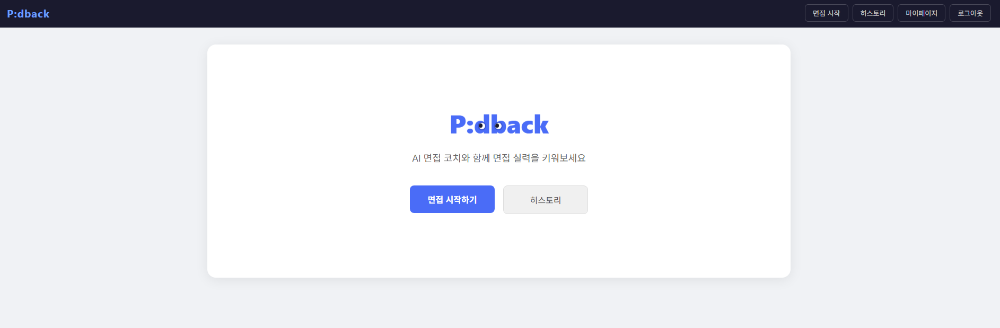

---

## 목차

- [프로젝트 소개](#프로젝트-소개)
- [관련 문서](#관련-문서)
- [기술 스택](#기술-스택)
- [프로젝트 구조](#프로젝트-구조)
- [아키텍처 & 사용 흐름](#아키텍처--사용-흐름)
- [주요 기능(스크린샷)](#주요-기능)
- [**내 담당 기능 상세**](#내-담당-기능-상세)
- [**트러블슈팅 & 코드리뷰**](#트러블슈팅--코드리뷰)
- [API 엔드포인트](#api-엔드포인트)
- [로컬 실행 방법](#로컬-실행-방법)
- [회고 및 개선사항](#회고-및-개선사항)

---

## 프로젝트 소개

**🖥️ 배포 주소**: [https://pdback.live](https://pdback.live)

P:dback은 실제 화상 면접 환경을 시뮬레이션하여 기술 면접을 연습할 수 있는 웹 애플리케이션입니다.  
MediaPipe 기반의 Vision AI로 자세와 시선을 분석하고, STT로 음성 답변을 텍스트로 변환한 뒤, <br>
Google Gemini API가 질문별 피드백과 종합 점수를 산출합니다.

- **개발 기간**: 2026.03.12 - 2026.04.02
- **구성**: 5인 팀 프로젝트
- **배포 환경**: AWS EC2 + Docker + GitHub Actions CI/CD
- [원본 팀 레포](https://github.com/gabriel-1204/Pdback)

| 이름 | 역할 |
|------|------|
| [김상혁](https://github.com/gabriel-1204) | 초기 세팅, 인프라, Docker / AWS EC2 배포, CI/CD, mediapipe |
| [김유선](https://github.com/kimyuseon) | 회원가입 / 로그인 / 마이페이지 (user 백엔드 + 프론트엔드), 인증 |
| [김평일](https://github.com/Pyeongil) | Gemini 프롬프트 설계, 면접 설정 페이지, Gemini API 클라이언트 |
| [이영진](https://github.com/ilove0628yj-w) | 면접 페이지, 세션 진행 (interview 도메인 백엔드 + 프론트엔드) |
| [박지영](https://github.com/battlegroundcallofduty) | 피드백 생성 / 조회, 면접 history (feedback 백엔드 + 프론트엔드) |

---

## 관련 문서

- [발표자료](https://docs.google.com/presentation/d/1MYbXQMjmEeGZ17ftSzQG7iYQLF4TTpXkVjnmqI-kvqE/edit?usp=sharing)
- [서비스 플로우차트 계획](https://battlegroundcallofduty.github.io/Pdback_live/assets/flowchart.html)
- [초반 DB 스키마](https://battlegroundcallofduty.github.io/Pdback_live/assets/pdback-schema%20(1).html)

---

## 기술 스택

### Backend


### AI / Interview Engine


### Frontend


### Infra / DevOps


---

## 프로젝트 구조

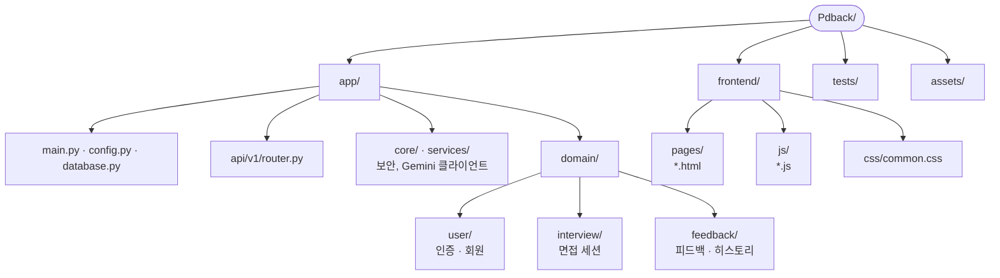
```mermaid
graph TD
    Root(["Pdback/"])

    Root --> App["app/"]
    App --> Main["main.py · config.py · database.py"]
    App --> Api["api/v1/router.py"]
    App --> Core["core/ · services/<br/>보안, Gemini 클라이언트"]
    App --> Domain["domain/"]
    Domain --> User["user/<br/>인증 · 회원"]
    Domain --> Interview["interview/<br/>면접 세션"]
    Domain --> Feedback["feedback/<br/>피드백 · 히스토리"]

    Root --> Frontend["frontend/"]
    Frontend --> Pages["pages/<br/>*.html"]
    Frontend --> JS["js/<br/>*.js"]
    Frontend --> CSS["css/common.css"]

    Root --> Tests["tests/"]
    Root --> Assets["assets/"]
```

---

## 아키텍처 & 사용 흐름

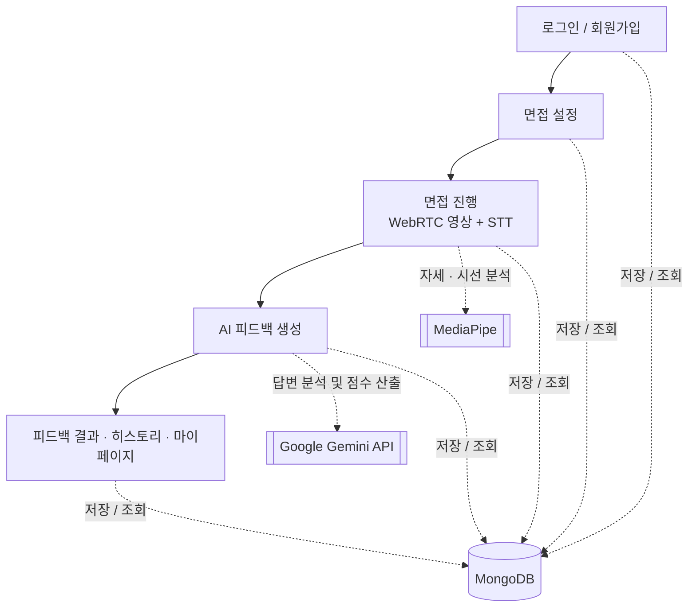
```mermaid
flowchart TD
    A["로그인 / 회원가입"] --> B["면접 설정"]
    B --> C["면접 진행<br/>WebRTC 영상 + STT"]
    C --> D["AI 피드백 생성"]
    D --> E["피드백 결과 · 히스토리 · 마이페이지"]

    C -.자세 · 시선 분석.-> MP[["MediaPipe"]]
    D -.답변 분석 및 점수 산출.-> GM[["Google Gemini API"]]

    A & B & C & D & E -.저장 / 조회.-> DB[("MongoDB")]
```

---

## 주요 기능

### 1️⃣ 회원가입 · 로그인
| 회원가입 | 로그인 |
|:---------:|:---------:|                                                                                                              
| 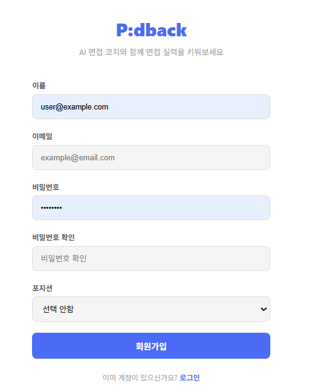 | 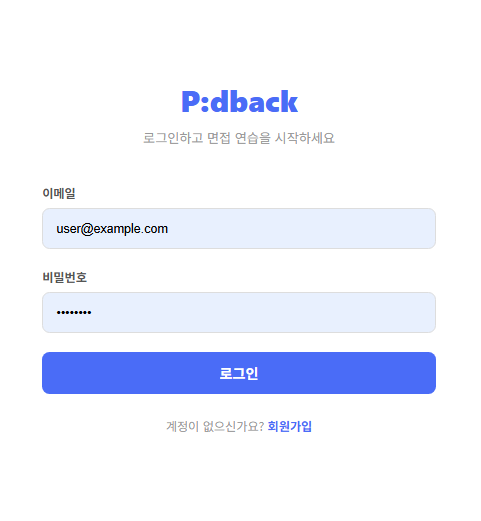 | 

### 2️⃣ 면접 설정 · 진행 · AI 분석

- **AI 면접 진행**: Gemini 기반 면접관 페르소나로 실시간 질의응답
- **자세 / 시선 분석**: MediaPipe로 자세 안정성 및 카메라 시선 처리율 실시간 측정
- **음성 인식 (STT)**: Web Speech API로 답변 음성을 텍스트로 변환

| 면접 설정 | 면접 진행 |
|:---------:|:---------:|
| 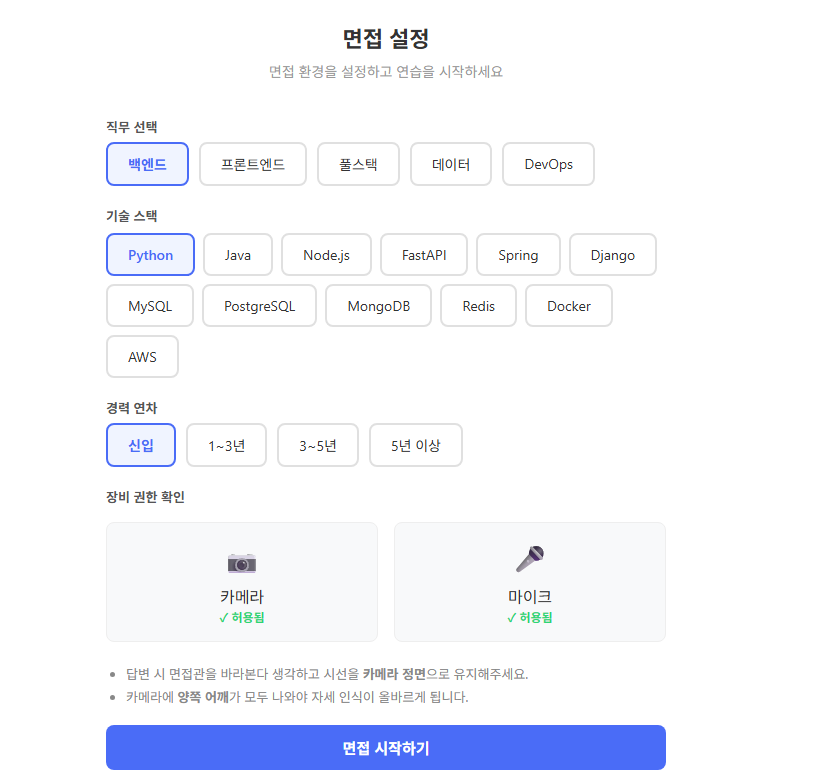 | 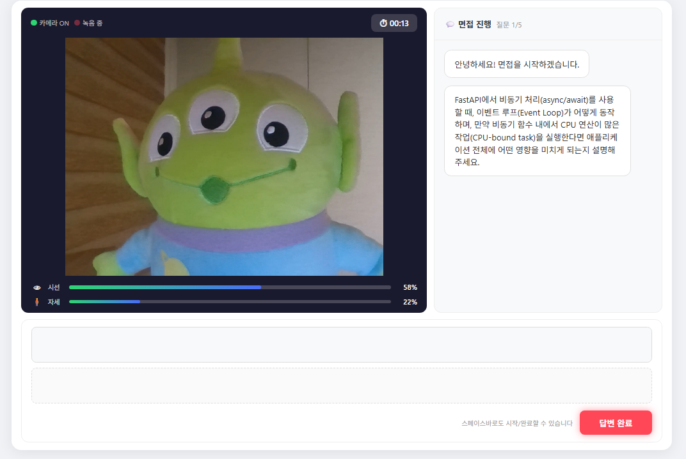 |

### 3️⃣ AI 피드백 생성

- 질문별 점수, 기술 / 논리 / 키워드 종합 점수, 강점 및 개선점 제공
- 자세·시선 점수와 코멘트 자동 생성

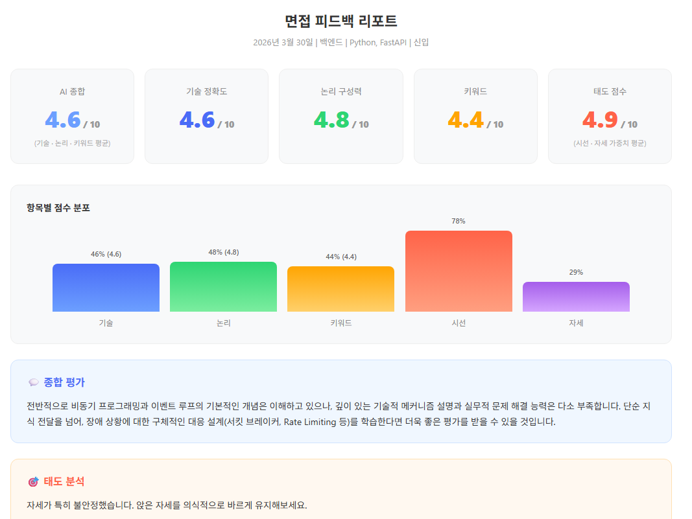
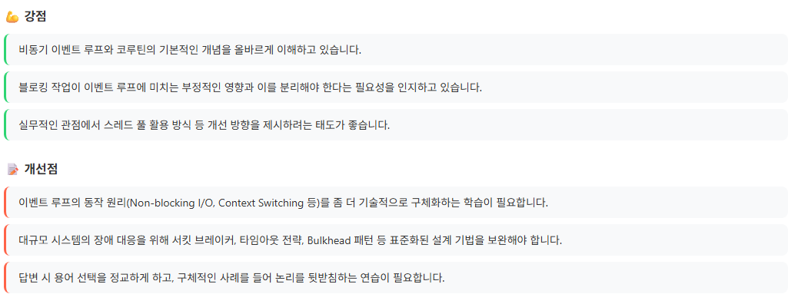
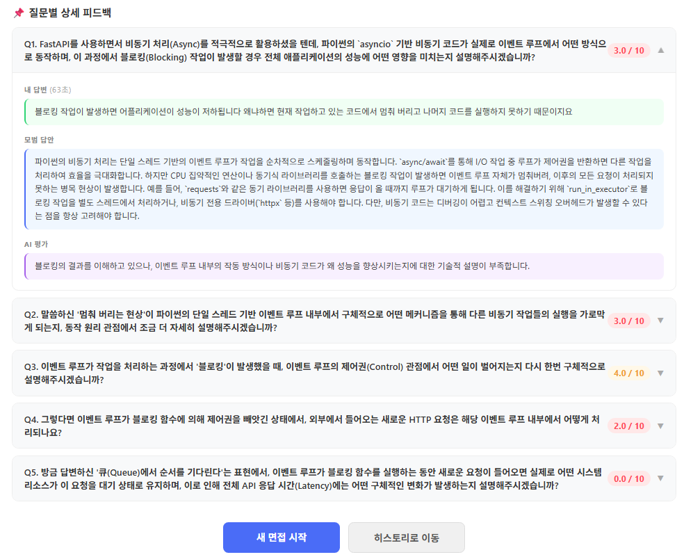

### 4️⃣ 면접 히스토리

- 과거 면접 목록 최신순 조회 및 점수 추이 바 차트 시각화

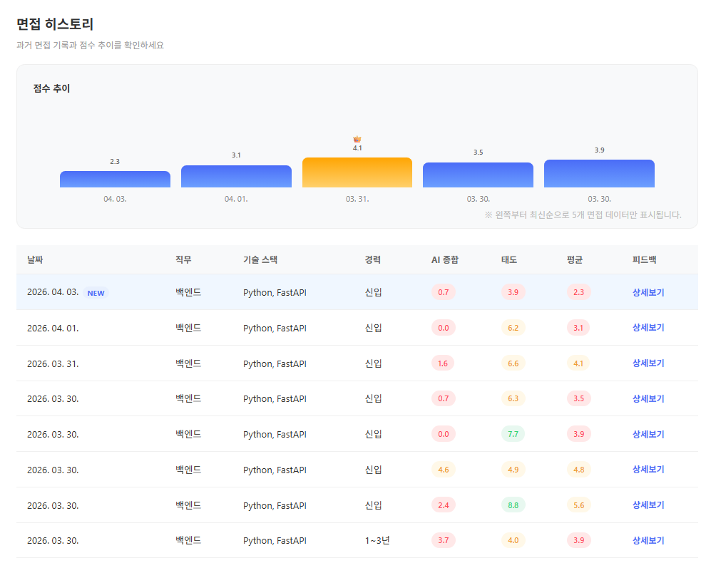

### 5️⃣ 마이페이지

- 프로필 수정, 비밀번호 변경 및 총 면접 횟수, 평균 점수, 최고 점수, 이번 주 면접 횟수 집계

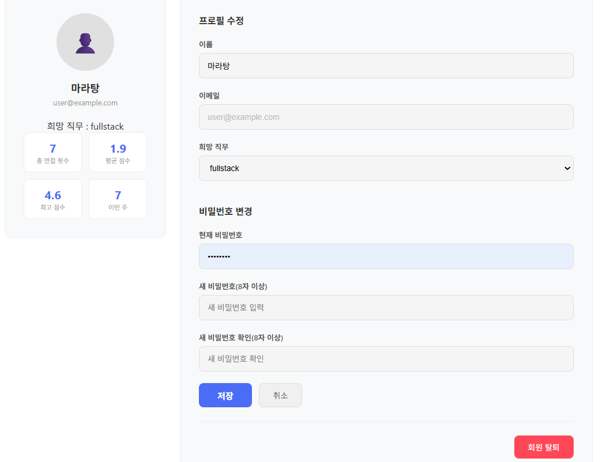

---

## 내 담당 기능 상세

**담당 범위**: `feedback` 도메인 전체 (백엔드 + 프론트엔드)  
`app/domain/feedback/`, `frontend/pages/feedback.html`, `frontend/pages/history.html`, `frontend/js/feedback.js`, `frontend/js/history.js`

### 1. 피드백 생성 및 조회 (feedback.html)

면접 종료 후 면접 세션 데이터를 바탕으로 AI 피드백을 생성하고 결과를 시각화합니다.

- **중복 생성 차단**: 동일 면접에 대해 피드백이 이미 존재하면 `409 Conflict` 반환 — 면접 종료 직후 새로고침이나 버튼 중복 클릭 시 같은 document가 두 번 삽입되는 것을 방지

  ```python
  existing = await db["feedbacks"].find_one({"interview_id": session_id})
  if existing:
      raise HTTPException(status_code=409, detail="이미 생성된 피드백이 존재합니다. 히스토리 페이지를 참고해주세요.")
  ```

- **소유자 검증**: 타인의 면접 데이터에 대한 피드백 생성/조회 방지 (`403 Forbidden`)

  ```python
  if interview.user_id != user_id:
      raise HTTPException(status_code=403, detail="본인의 면접에 대한 피드백만 생성할 수 있습니다.")
  ```
- **AI 피드백 파싱**: Gemini 응답이 마크다운 코드블록으로 래핑되는 경우를 대비해 정규식으로 벗겨낸 뒤 JSON 파싱 — 외부 AI API 응답을 신뢰하지 않는 방어적 처리

  ```python
  raw = response.text.strip()
  try:
      data = json.loads(raw)           # 깔끔한 JSON이면 바로 파싱
  except json.JSONDecodeError:
      raw = re.sub(r"^```(?:json)?\s*", "", raw)   # 앞 ```json 제거
      raw = re.sub(r"\s*```$", "", raw).strip()    # 뒤 ``` 제거
      data = json.loads(raw)           # 재시도
  ```
- **자세/태도 점수 산출**: 시선 처리율(`eye_contact`)과 자세 안정성(`posture_safety_rate`)을 가중 평균(`시선 40% + 자세 60%`)하여 태도 점수 계산, 두 지표를 각각 부족(60 미만) / 보통(60~80) / 완벽(80 이상) 3단계로 나눈 종합별 9가지 코멘트 자동 생성

- **응답 시간 표시**: 질문별 내 답변 옆에 소요 시간(duration_seconds)을 함께 표시

### 2. 면접 히스토리 (history.html)

사용자의 과거 면접 목록을 최신순으로 조회하고, 점수 추이를 바 차트로 시각화합니다.  


- **N+1 쿼리 제거**: 피드백 목록 조회 후 면접 데이터를 건별로 조회하는 방식에서 MongoDB `$in` 연산자로 한 번에 일괄 조회하도록 개선
- **페이지네이션**: `page` / `size` 파라미터 기반 서버 사이드 페이지네이션 구현
- **방어 로직**: 면접 데이터가 없는 피드백(DB 정리 후 고아 데이터)은 응답에서 자동 스킵

  ```python
  interview = interviews.get(feedback_doc.interview_id)
  if interview is None:
      continue  # 면접 데이터가 없는 피드백 스킵
  ```
- 전체 면접 플로우 없이 UI를 빠르게 확인하기 위해 `feedback_test.py`, `history_test.py`로 DB에 더미 데이터를 직접 삽입해 로컬 테스트를 진행

### 3. 마이페이지 통계 연동

- `GET /feedback/stats` 엔드포인트로 총 면접 횟수, 평균 점수, 최고 점수, 이번 주 면접 횟수 집계.

---

## 트러블슈팅 & 코드리뷰

> 백엔드 4건 · 프론트엔드 4건. 각 항목은 '문제 → 원인 → 해결 → 결과' 순서로 정리했습니다.

### ㅡ 백엔드

### (1) 인증 없이 타인의 히스토리 조회 가능

**문제** : `GET /feedback/history/{user_id}`가 `user_id`를 URL 경로에 직접 받는 구조. 로그인 없이 URL의 `user_id`만 바꿔 넣으면 해당 사용자의 면접 히스토리 전체가 노출됨.

**원인** : 인증 의존성이 붙기 전 UI 확인용으로 만든 임시 구조가 그대로 남음. 코드리뷰에서 보안 이슈로 지적.

**해결** : 팀원이 만든 JWT 인증 의존성 `Depends(get_current_user)`를 주입해 토큰(payload의 `sub` 클레임)에서 `user_id`를 추출하도록 변경. feedback 도메인의 다른 엔드포인트도 동일하게 통일.

```python
# Before: URL 경로에 user_id를 직접 넣어 조회 가능
@router.get("/history/{user_id}", response_model=list[FeedbackResponse])
async def api_get_history(user_id: str):
    return await get_history(user_id)

# After: JWT에서 user_id 추출 — 본인 데이터만 조회
@router.get("/history", response_model=HistoryResponse)
async def api_get_history(current_user: str = Depends(get_current_user)):
    return await get_history(current_user)
```

**결과** : 본인 데이터만 조회 가능. feedback 도메인 4개 엔드포인트(`/generate`, `/history`, `/stats`, `/{interview_id}`) 전부 JWT 필수로 통일.
<br>

### (2) 히스토리 조회 — N+1 쿼리와 무제한 메모리 적재

**문제** : 히스토리 목록을 가져올 때 ① 피드백마다 면접 데이터를 개별 조회해 N번의 DB 왕복 발생 ② `to_list(length=None)`으로 사용자의 전체 피드백을 한 번에 메모리에 적재. 면접 기록이 쌓일수록 응답 시간과 메모리 사용량이 함께 증가하는 구조.

**원인** : 초기 구현 시 조회 건수가 적어 문제가 드러나지 않았고, 코드리뷰에서 지적받음.

**해결** : 면접 ID 목록을 `$in`으로 한 번에 조회한 뒤 딕셔너리로 매핑해 단일 쿼리로 처리. 서버 사이드 페이지네이션(`skip` + `limit`)을 도입해 요청당 `size`건만 조회.

```python
# Before: 피드백 N개 → 면접 N번 조회, 전체 피드백을 메모리에 한꺼번에 로드
docs = await db["feedbacks"].find({"user_id": user_id}).to_list(length=None)

result = []
for doc in docs:
    feedback_doc = FeedbackDocument(**doc)
    interview = await _get_interview(feedback_doc.interview_id)  # 내부에서 find_one 호출 → N+1
    result.append(_to_response(feedback_doc, interview))

# After: skip + limit으로 페이지 단위 조회 → 면접은 $in으로 1번에 조회
total = await db["feedbacks"].count_documents({"user_id": user_id})
skip = (page - 1) * size

docs = await db["feedbacks"].find({"user_id": user_id}) \
    .sort("created_at", -1) \
    .skip(skip).limit(size).to_list(length=None)

feedback_docs = [FeedbackDocument(**doc) for doc in docs]
interview_ids = [f.interview_id for f in feedback_docs]

interview_list = await db["interviews"].find(
    {"_id": {"$in": interview_ids}}
).to_list(length=None)
interviews = {doc["_id"]: InterviewDocument(**doc) for doc in interview_list}
```

**결과** : 요청당 DB 왕복이 건수와 무관하게 3회(전체 개수 카운트 1회 + 피드백 조회 1회 + 면접 조회 1회)로 고정. 메모리에 올라오는 피드백은 최대 `size`건으로 제한. 면접 데이터가 없는 고아 피드백은 응답에서 스킵하는 방어 로직도 함께 추가.
<br>

### (3) 에러가 원인과 무관하게 전부 500으로 응답됨
 
**문제** : 비즈니스 로직에서 `ValueError`, `RuntimeError`를 그대로 던지면 FastAPI가 잡지 못해 모든 실패가 500으로 응답. 프론트가 "다시 시도해도 되는 오류"인지 "권한 문제"인지 구분할 수 없었음.
 
**원인** : 예외 종류와 HTTP 응답의 대응 관계를 정하지 않은 채 구현. 코드리뷰에서 지적.
 
**해결** : `HTTPException`으로 통일하고 상황별 상태 코드를 분리 — 피드백 중복 생성 409, 소유자 불일치 403, Gemini 호출 실패 502.

**결과** : 프론트가 상태 코드만으로 "히스토리로 이동(409)" / "권한 없음(403)" / "재시도 안내(502)"를 구분해 처리 가능. 면접 종료 직후 새로고침 · 버튼 중복 클릭으로 같은 document가 두 번 삽입되는 문제도 409로 차단.
<br>

### (4) 응답 시간 측정 기준 오류 — 질문 생성 시점 → 프론트 측정값으로 교체
 
**문제** : 질문별 답변 소요 시간이 실제보다 훨씬 길게 표시됨.
 
**원인** : 서버에서 `started_at`(질문 저장 시각)과 `ended_at`(답변 제출 시각)의 차이로 계산해, AI가 질문을 생성하는 시간과 사용자가 질문을 읽는 시간까지 포함됨.
 
**해결** : 프론트에서 "답변 시작" 버튼 클릭부터 "답변 완료" 클릭까지를 직접 측정해 `duration_seconds`로 전송하고, 서버는 이 값을 우선 사용. 값이 없으면 기존 계산으로 폴백. interview 도메인 코드라 담당 팀원 확인 후 수정.

**결과** : 사용자가 실제로 말한 시간만 측정됨. "무엇을 측정하는지"는 그 시점을 가장 정확히 아는 쪽(클라이언트)이 정하고, 서버는 검증과 폴백만 맡는 구조로 정리.
<br>

### ㅡ 프론트엔드

### (5) 세션 완료 후 피드백이 저장되지 않고 페이지 이동
 
**문제** : 마지막 세션 종료 후 "다음" 버튼을 누르면 히스토리 페이지에 방금 한 면접이 없음.
 
**원인** : 피드백 생성 API 응답을 기다리지 않고 바로 페이지를 이동해, 저장 전에 히스토리가 열림.
 
**해결** : 피드백 생성 요청을 `await`한 뒤 이동. 저장 실패 시에도 면접 자체는 완료된 상태이므로 이동은 항상 진행.

**결과** : 히스토리에 방금 한 면접이 즉시 표시. 현재 코드는 `authFetch`로 리팩토링되고 단일 세션 종료 후 "히스토리로 이동" 버튼을 표시하는 구조.
<br>

### (6) NEW 뱃지 표시 오류 — `created_at` UTC 파싱 문제
 
**문제** : 방금 생성된 면접에 "NEW" 뱃지가 붙지 않음.
 
**원인** : MongoDB에서 반환된 ISO 문자열에 `Z` suffix가 없으면 브라우저가 로컬 시간으로 파싱해 9시간 오차 발생. `Date.now() - new Date(item.created_at)` 결과가 항상 기준을 초과.
 
**해결** : `'Z'`가 없으면 명시적으로 붙여 UTC로 강제 파싱.

**결과** : 뱃지 정상 표시. 근본 원인은 서버 응답의 타임존 표기가 일관되지 않은 것이라, 저장 · 내부 로직을 UTC로 통일하는 개선을 추후 개선 사항에 기록.
<br>

### (7) 인라인 이벤트 핸들러 중복 등록 — 아코디언 버그

**문제** : 피드백 페이지 질문 아코디언이 클릭 한 번에 두 번 토글됨.

**원인** : `onclick="toggleQuestion(this)"`로 각 요소에 직접 바인딩해, DOM이 다시 렌더링될 때 핸들러가 중복 등록됨.

**해결** : 컨테이너(`#question-feedbacks`)에 한 번만 등록하는 이벤트 위임 방식으로 변경.

```javascript
// Before
item.innerHTML = `<div class="question-header" onclick="toggleQuestion(this)"> ... </div>`

// After — 컨테이너에 이벤트 위임 한 번만 등록
document.getElementById('question-feedbacks').addEventListener('click', function(e) {
  const header = e.target.closest('.question-header');
  if (header) toggleQuestion(header);
});
```

**결과** : 리렌더링 횟수와 무관하게 핸들러 1개만 유지.
<br>

### (8) 페이지네이션 버튼이 동작하지 않는 버그
 
**문제** : 히스토리 페이지의 페이지네이션 버튼을 눌러도 반응 없음.
 
**원인** : `renderPagination()`이 HTML 문자열로 버튼을 생성하며 `onclick="goPage(n)"`을 사용했는데, `goPage`가 모듈 스코프에만 선언되어 전역에서 접근 불가.
 
**해결** : `window.goPage`로 전역 노출하고, 범위를 벗어난 페이지 번호 요청은 차단.

**결과** : 페이지 이동 정상 동작, 잘못된 페이지 번호로 인한 불필요한 API 호출 차단.

---

## API 엔드포인트

### •  Feedback (담당 파트)

| Method | Endpoint | 설명 | 인증 |
|--------|----------|------|------|
| `POST` | `/api/v1/feedback/generate` | 면접 종료 후 AI 피드백 생성 | JWT 필요 |
| `GET` | `/api/v1/feedback/history` | 내 면접 히스토리 목록 조회 (페이지네이션) | JWT 필요 |
| `GET` | `/api/v1/feedback/stats` | 마이페이지 통계 조회 | JWT 필요 |
| `GET` | `/api/v1/feedback/{interview_id}` | 피드백 상세 조회 | JWT 필요 |

### •  전체 API (Swagger UI)
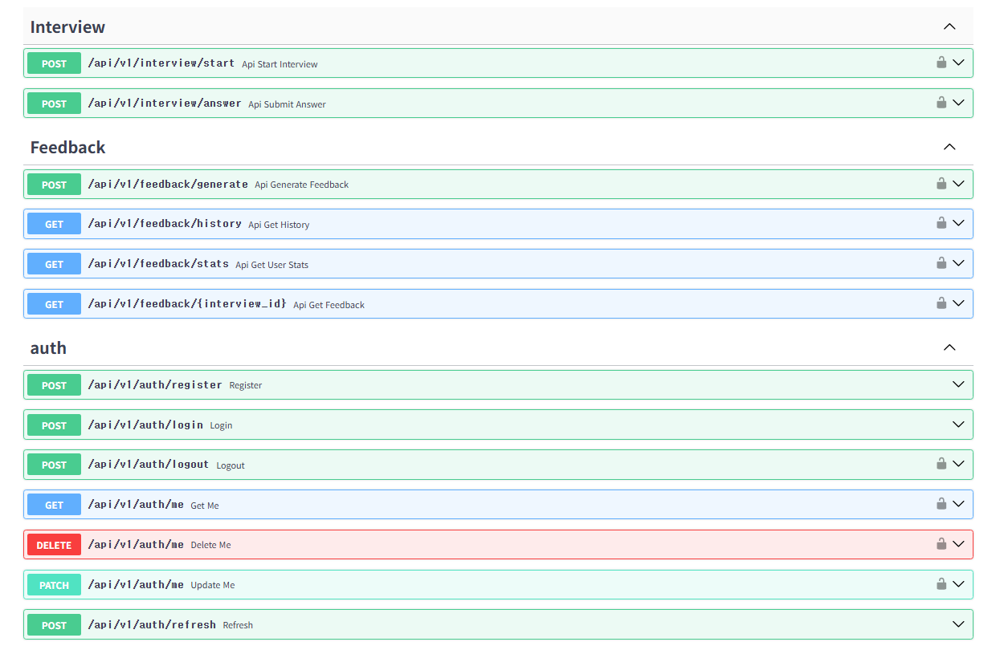

---

## 로컬 실행 방법

### ▪️ 환경 설정

```bash
cp .env.example .env
```

`.env` 파일에 아래 항목을 채워넣습니다.

| 변수 | 설명 |
|------|------|
| `GEMINI_API_KEY` | Google Gemini API 키 |
| `MONGODB_URL` | MongoDB 연결 URI (예: `mongodb://localhost:27017`) |
| `MONGODB_DB_NAME` | 사용할 데이터베이스 이름 |
| `DEBUG` | 디버그 모드 (`true` / `false`) |
| `CORS_ORIGINS` | 허용할 CORS 출처 (예: `http://localhost:8000`) |
| `SECRET_KEY` | JWT 서명용 시크릿 키 |

### ▪️ pip으로 실행

```bash
python -m venv venv
source venv/bin/activate  # Windows: venv\Scripts\activate
pip install -r requirements.txt
uvicorn app.main:app --reload
```

### ▪️ Docker로 실행

```bash
docker compose up --build
```


---

## 회고 및 개선사항

### ㅡ 회고

**1. 팀 간 인터페이스 동기화**
 
피드백 도메인은 다른 팀원이 만든 데이터들을 조회하거나 가공하는 구조입니다.  
토큰 필드명(access_token), interview ID 방식(UUID vs MongoDB ObjectId), 모델 필드명 변경이 생길 때마다 인터페이스를 맞추는 과정에서, 팀원간의 소통과 협업의 중요성을 체감했습니다.
 
**2. `bad_posture_count` 모델 설계 수정**
 
초기에는 불량 자세 횟수(`bad_posture_count`)를 저장하려 했습니다. 그러나 피드백 페이지를 설계하면서 현재 수집 데이터로는 의미 있는 `bad_posture_count`를 산출하기도 어렵고 사용자들에게 활용도가 낮은 정보라고 판단했습니다.  
이에 따라 불량 자세 횟수 필드는 삭제하고 원래 넣기로 계획되어 있던 태도 점수(`attitude_score`) 필드를 설계했습니다.
시선 처리율(`eye_contact`)과 자세 안정성(`posture_safety_rate`)을 가중 평균한 `attitude_score`로 필드를 넣어 피드백 페이지에서 바로 활용할 수 있는 형태로 정리했습니다.
 
**3. 코드리뷰로 배운 것**
 
담당 파트의 백엔드 이슈 4건 중 3건(인가 누락, N+1 · 메모리 적재, 에러 처리)이 모두 코드리뷰에서 나왔습니다. 로컬에서 소량 데이터로 테스트할 때는 인지하지 못했던 부분이라, "동작한다"와 "안전하다 · 확장된다"는 다른 기준이라는 것을 깨달았습니다.

---

### ㅡ 개선하고 싶은 사항

**타임존 처리 통일**  
MongoDB는 UTC(국제표준시)로 시각을 저장하는데, 이번 주 면접 횟수 집계 등 일부 로직에서는 KST(한국표준시) 기준으로 비교하면 시간 오차가 발생할 수 있습니다. 예를 들어 현재 코드에서는 tzinfo가 없는 경우(naive datetime)나 week_start 계산 기준을 KST로 잡고 계산해서 두 타임존이 혼용됩니다. 저장 시점과 내부 로직을 전부 UTC로 통일시키고 사용자 화면에 표시할때만 KST로 변환해야 9시간 오차나 혼용되는 상황을 방지할 수 있습니다.

**DB 인덱스 추가**  
현재 `feedbacks` 컬렉션에 인덱스가 없어, 사용자 데이터가 쌓일수록 히스토리 조회 쿼리(`user_id` 필터 + `created_at` 내림차순 정렬)가 컬렉션 전체를 풀스캔하게 됩니다. `(user_id, created_at)` 복합 인덱스를 추가하면 데이터가 증가해도 조회 성능을 일정하게 유지할 수 있습니다.

**피드백 DELETE 기능 추가**  
현재 서비스에서는 피드백의 create(생성), read(조회) 기능만 가능합니다. 피드백을 삭제할 수 있는 delete(삭제) 기능을 추가하고 사용자가 본인의 피드백만 직접 삭제할 수 있도록 권한 로직도 강화하여 서비스의 완성도를 높이고 싶습니다.

**피드백 페이지: 예상 답변 시간 표시**  
현재 내 답변 소요 시간만 보여주고 있습니다. interview 모델에 이미 예상 답변 시간 필드가 존재하므로, 이를 활용해 모범 답안 옆에 "예상 시간 OO초"를 함께 표시하면 사용자가 답변 속도를 더 직관적으로 파악할 수 있습니다.

**히스토리 페이지: 상단 바 차트 정렬 기준 추가/ 하단 목록 시간 표시**  
현재 상단 바 차트에서 최신순 5개 데이터를 고정 표시하고 있습니다. 면접 준비 목적의 사용자 입장에서는 최신순보다 최고 점수순이나 특정 직군 필터가 더 유용할 수 있어, 사용자가 정렬 기준을 선택할 수 있도록 개선하고 싶습니다.  
또한 같은 날 면접을 여러 번 진행하면 하단 피드백 목록에서 구분이 어렵습니다. 날짜만 표시하는 현재 방식에서 시:분까지 추가하면 UX가 개선될 것입니다.

---

### 🔖 발표 후 받은 피드백 (추가 기능 아이디어)

- 카메라 영점 보정 기능 (자세·시선 측정 전 기준점 설정)
- 마이크 볼륨 세부 컨트롤 및 감도 조정
- 직무 / 기술 스택 퍼스널 커스텀 설정
- JD(직무기술서) 파일 또는 텍스트를 입력하면 관련 질문을 자동 구성하는 기능
- GitHub Actions 기반 PR 자동화

---

*백엔드 상세 Git 작업 가이드는 [TEAM_README.md](./TEAM_README.md)를 참고하세요.*
